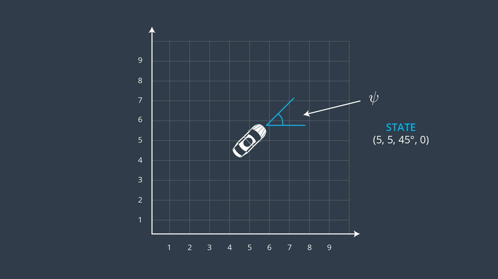

# Model Predictive Control
This project implements the model predictive control submission required towards completion of the Self Driving Car Nanodegree. The objectives of the project are as follows
* Implement a MPC::Solve Function to find out the best trajectory to be followed
* Tune the various hyper parameters for best performance (I went with raw speed)
* Submit a writeup and explain the methodology of the solution

## Kinematic Model
The Vehicle Provided in the simulator works on a Ackermann steering based Kinematic Model, with one drive element and one orientation (steering) element. The Drive element is responsible for the forward force while the orientation element is responsible for angular direction.


### State update Equations
The State update equations of the model can be described as follows


### Error Equations
There are two types of error
* Cross Track Error: This is the difference in the lateral component in the car's reference frame
* psi Error: Error in orientation
These are calculated as


## Implementation Description
The overall information flow is illustrated by the following figure


### Choice of N and dt
I chose dt to mirror the latency. This way one update per latency cycle can be maintained and we are not predicting too many values in too small an interval because latency will cause this to behave erratically

Choice of N: This was pretty much tuned empirically
Observations: Setting it too far resulted in delay in reducing the cost and bringing the trajectory in alignment with reference. This sometimes caused vehicle to understeer and go off road on sharp turns. Setting it to too small a value resulted in shudden shifts and overshoots. This also sometimes resulted in the car leaving the track

### Latency
Latency is dealt with by applying a kinematic update on the current state with dt = latency to arrive at a predicted state this state is then passed on the mpc as the starting point so that it takes into account where the vehicle might be when the next control input shall be applied.

## Dependencies

* cmake >= 3.5
 * All OSes: [click here for installation instructions](https://cmake.org/install/)
* make >= 4.1
  * Linux: make is installed by default on most Linux distros
  * Mac: [install Xcode command line tools to get make](https://developer.apple.com/xcode/features/)
  * Windows: [Click here for installation instructions](http://gnuwin32.sourceforge.net/packages/make.htm)
* gcc/g++ >= 5.4
  * Linux: gcc / g++ is installed by default on most Linux distros
  * Mac: same deal as make - [install Xcode command line tools]((https://developer.apple.com/xcode/features/)
  * Windows: recommend using [MinGW](http://www.mingw.org/)
* [uWebSockets](https://github.com/uWebSockets/uWebSockets)
  * Run either `install-mac.sh` or `install-ubuntu.sh`.
  * If you install from source, checkout to commit `e94b6e1`, i.e.
    ```
    git clone https://github.com/uWebSockets/uWebSockets 
    cd uWebSockets
    git checkout e94b6e1
    ```
    Some function signatures have changed in v0.14.x. See [this PR](https://github.com/udacity/CarND-MPC-Project/pull/3) for more details.
* Fortran Compiler
  * Mac: `brew install gcc` (might not be required)
  * Linux: `sudo apt-get install gfortran`. Additionall you have also have to install gcc and g++, `sudo apt-get install gcc g++`. Look in [this Dockerfile](https://github.com/udacity/CarND-MPC-Quizzes/blob/master/Dockerfile) for more info.
* [Ipopt](https://projects.coin-or.org/Ipopt)
  * Mac: `brew install ipopt`
  * Linux
    * You will need a version of Ipopt 3.12.1 or higher. The version available through `apt-get` is 3.11.x. If you can get that version to work great but if not there's a script `install_ipopt.sh` that will install Ipopt. You just need to download the source from the Ipopt [releases page](https://www.coin-or.org/download/source/Ipopt/) or the [Github releases](https://github.com/coin-or/Ipopt/releases) page.
    * Then call `install_ipopt.sh` with the source directory as the first argument, ex: `bash install_ipopt.sh Ipopt-3.12.1`. 
  * Windows: TODO. If you can use the Linux subsystem and follow the Linux instructions.
* [CppAD](https://www.coin-or.org/CppAD/)
  * Mac: `brew install cppad`
  * Linux `sudo apt-get install cppad` or equivalent.
  * Windows: TODO. If you can use the Linux subsystem and follow the Linux instructions.
* [Eigen](http://eigen.tuxfamily.org/index.php?title=Main_Page). This is already part of the repo so you shouldn't have to worry about it.
* Simulator. You can download these from the [releases tab](https://github.com/udacity/self-driving-car-sim/releases).
* Not a dependency but read the [DATA.md](./DATA.md) for a description of the data sent back from the simulator.


## Basic Build Instructions


1. Clone this repo.
2. Make a build directory: `mkdir build && cd build`
3. Compile: `cmake .. && make`
4. Run it: `./mpc`.


```python

```
